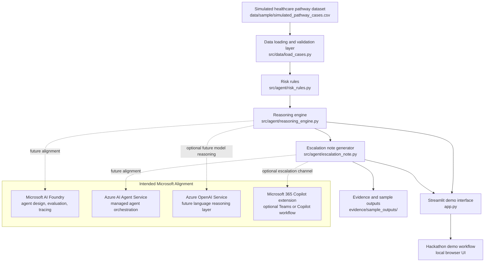

# Agent Architecture

## Overview

The Azure Healthcare Pathway Reasoning Agent is a local-first prototype that demonstrates how a reasoning agent can analyze fully synthetic healthcare pathway data, identify operational risk, explain the reasoning, recommend next actions, and generate structured escalation notes for human review.

The current implementation is deterministic and explainable. It does not call external AI APIs and does not deploy Azure resources.

## Architecture Diagram

## Current Implemented Flow

1. The app loads fully synthetic pathway records from `data/sample/simulated_pathway_cases.csv`.
2. `src/data/load_cases.py` validates required columns and unique case IDs.
3. `src/agent/risk_rules.py` evaluates transparent operational risk factors.
4. `src/agent/reasoning_engine.py` calculates a risk score, assigns a risk level, explains the reasoning, and recommends next actions.
5. `src/agent/escalation_note.py` converts the reasoning output into a structured operational note.
6. `app.py` provides a Streamlit demo interface for selecting a case, viewing reasoning, and downloading a Markdown escalation note.
7. `evidence/sample_outputs/` stores sample escalation notes for judging and demo review.

## Agent Responsibilities

The current agent pattern is intentionally narrow:

- Ground reasoning in visible structured data fields.
- Apply deterministic risk rules.
- Make every risk factor inspectable.
- Generate operational explanations in plain language.
- Recommend next actions for human review.
- Produce structured notes that can be reused in future workflow integrations.

## Microsoft AI Foundry Alignment

The local prototype is designed to map cleanly to Microsoft AI Foundry and Azure AI agent patterns later:

| Current Prototype | Future Microsoft Pattern |
| --- | --- |
| Local CSV synthetic dataset | Azure Storage, Azure SQL, or Foundry-connected data source |
| Rule-based reasoning functions | Azure AI Agent Service tool or function call |
| Test suite and sample outputs | Azure AI Foundry evaluation assets |
| Streamlit local demo | Azure App Service, Container Apps, or internal demo portal |
| Markdown escalation note | Microsoft Teams, Outlook, or Microsoft 365 Copilot workflow |
| Local safety statements | Foundry safety evaluations and governance documentation |

## Optional Microsoft 365 Copilot Extension

A future Microsoft 365 Copilot extension could expose the escalation note workflow inside Microsoft Teams or Copilot Chat. A user could ask for a pathway case summary, review risk factors, and draft an escalation note for a coordination huddle.

That extension is not implemented in this milestone. It is included as a future integration direction only.

## Safety Boundary

The architecture uses simulated data only. It is for operational decision support demonstrations, not clinical diagnosis, clinical prioritization, or treatment advice. Every generated recommendation and escalation note requires human review before action.

