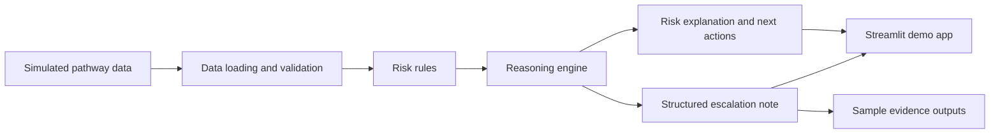

# High-Level Architecture

## Purpose

This document describes the current local-first architecture for the Azure Healthcare Pathway Reasoning Agent. The prototype now includes a synthetic dataset, data validation, deterministic risk rules, an explainable reasoning engine, structured escalation notes, sample evidence outputs, and a Streamlit demo app.

## Design Principles

- Use simulated healthcare pathway data only.
- Keep the prototype local-first for fast iteration and safe demonstration.
- Separate data loading, agent reasoning, evaluation, and reporting concerns.
- Produce explainable outputs that support human review.
- Align the design with Microsoft AI Foundry and Azure AI agent patterns.

## Local Prototype Flow

## Repository Responsibilities

| Path | Responsibility |
| --- | --- |
| `data/sample/` | Synthetic sample pathway records. |
| `src/data/` | Data loading, schema validation, and transformation utilities. |
| `src/agent/` | Risk rules, pathway reasoning, and escalation note generation. |
| `src/evaluation/` | Reserved for future output quality checks and repeatable evaluation examples. |
| `src/reporting/` | Reserved for future report generation modules. |
| `docs/architecture/` | Architecture documentation and design decisions. |
| `docs/hackathon/` | Hackathon brief, judging notes, and project positioning. |
| `evidence/` | Demo evidence, generated screenshots, evaluation outputs, and supporting artifacts. |
| `tests/` | Automated tests for data, reasoning, evaluation, and reporting modules. |
| `app.py` | Streamlit demo interface. |

## Planned Component Model

1. **Data Layer**
   - Reads simulated pathway records.
   - Validates expected fields.
   - Normalizes pathway status values.

2. **Reasoning Layer**
   - Applies operational risk heuristics.
   - Uses a deterministic agent pattern to explain why a pathway is flagged.
   - Produces structured reasoning outputs.

3. **Escalation Note Layer**
   - Converts reasoning outputs into escalation notes.
   - Supports consistent Markdown-ready templates for human review.

4. **Demo Layer**
   - Provides a Streamlit interface for case selection, reasoning review, and note download.
   - Supports a short hackathon demo workflow.

5. **Evidence Layer**
   - Stores sample Markdown escalation notes for judging and review.
   - Supports repeatable hackathon demos.

## Future Azure Mapping

| Local Prototype | Future Azure Pattern |
| --- | --- |
| Local simulated files | Azure Storage or Azure SQL with synthetic datasets |
| Local reasoning workflow | Azure AI Agent Service or Azure AI Foundry agent |
| Local model calls | Azure OpenAI Service |
| Local evaluation scripts | Azure AI Foundry evaluations |
| Local Streamlit demo | Azure App Service or Azure Container Apps |
| Local escalation note outputs | Azure Functions, Microsoft Teams, or Microsoft 365 Copilot extension |
| Local logs | Application Insights |

## Safety Boundary

The agent must not be used for diagnosis, treatment decisions, or clinical prioritization. It is positioned as an operational reasoning prototype using simulated data. All outputs should be reviewed by humans and treated as draft support material.
