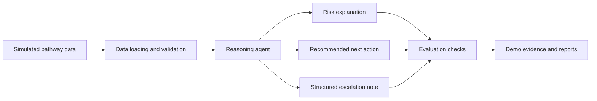

# High-Level Architecture

## Purpose

This document describes the proposed architecture for the Azure Healthcare Pathway Reasoning Agent. The current repository contains the foundation only; implementation will be added in later milestones.

## Design Principles

- Use simulated healthcare pathway data only.
- Keep the prototype local-first for fast iteration and safe demonstration.
- Separate data loading, agent reasoning, evaluation, and reporting concerns.
- Produce explainable outputs that support human review.
- Align the design with Microsoft AI Foundry and Azure AI agent patterns.

## Local Prototype Flow

## Repository Responsibilities

| Path | Responsibility |
| --- | --- |
| `data/sample/` | Synthetic sample pathway records. |
| `src/data/` | Data loading, schema validation, and transformation utilities. |
| `src/agent/` | Agent orchestration, pathway reasoning, and risk interpretation. |
| `src/evaluation/` | Output quality checks, safety checks, and repeatable evaluation examples. |
| `src/reporting/` | Structured escalation note and report generation. |
| `docs/architecture/` | Architecture documentation and design decisions. |
| `docs/hackathon/` | Hackathon brief, judging notes, and project positioning. |
| `evidence/` | Demo evidence, generated screenshots, evaluation outputs, and supporting artifacts. |
| `tests/` | Automated tests for data, reasoning, evaluation, and reporting modules. |

## Planned Component Model

1. **Data Layer**
   - Reads simulated pathway records.
   - Validates expected fields.
   - Normalizes pathway status values.

2. **Reasoning Layer**
   - Applies operational risk heuristics.
   - Uses an agent pattern to explain why a pathway is flagged.
   - Produces structured reasoning outputs.

3. **Reporting Layer**
   - Converts reasoning outputs into escalation notes.
   - Supports consistent templates for human review.

4. **Evaluation Layer**
   - Checks that outputs are complete, safe, and grounded in simulated data.
   - Supports repeatable hackathon demos.

## Future Azure Mapping

| Local Prototype | Future Azure Pattern |
| --- | --- |
| Local simulated files | Azure Storage or Azure SQL with synthetic datasets |
| Local reasoning workflow | Azure AI Agent Service or Azure AI Foundry agent |
| Local model calls | Azure OpenAI Service |
| Local evaluation scripts | Azure AI Foundry evaluations |
| Local report outputs | Azure Functions and Microsoft Teams integration |
| Local logs | Application Insights |

## Safety Boundary

The agent must not be used for diagnosis, treatment decisions, or clinical prioritization. It is positioned as an operational reasoning prototype using simulated data. All outputs should be reviewed by humans and treated as draft support material.

